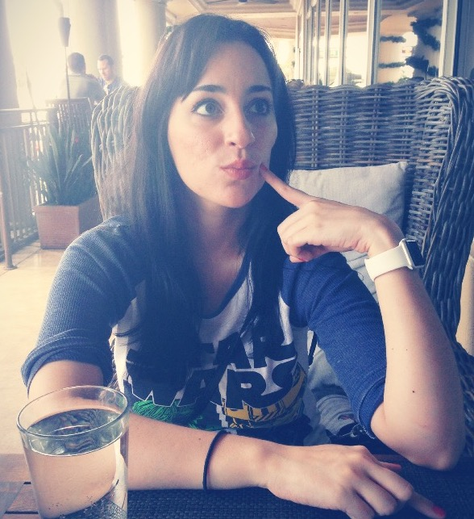

<figcaption>I wonder if they do sticky toffee pudding here?</figcaption>

Hello, world. My name is Rachel and I wear my sunglasses at night. I'm also a software engineer at Red Hat.

I've been a "webmaster" since the 90s (weren't we all?). I sometimes blog about technology from the perspective of a pragmatic developer, other times I blog about rainbows and unicorns. I've proudly been eating cheese since I grew my first baby tooth.

I was born in the beautiful Dominican Republic. I later went on to study Chemistry in college, but eventually decided to do what I had been doing for fun for most of my life -- lounging around, eating pizza, and writing code -- instead.

   
   Things I like: dancing - ballet, jazz+modern, jumping around, etc; dogs; eating - cheese, sticky toffee pudding
   ; whiskey + beer; climbing trees; programming; science; documentaries; learning; music; playing the guitar
   ; mechanical keyboards; pizza
   
 

